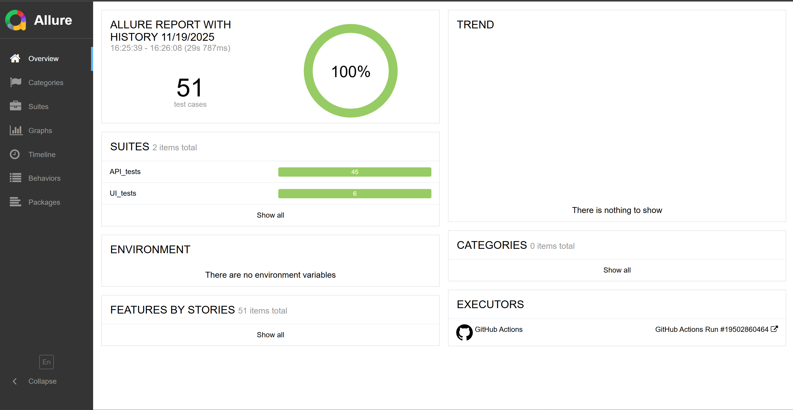
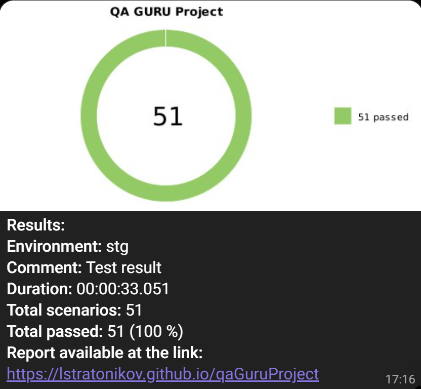
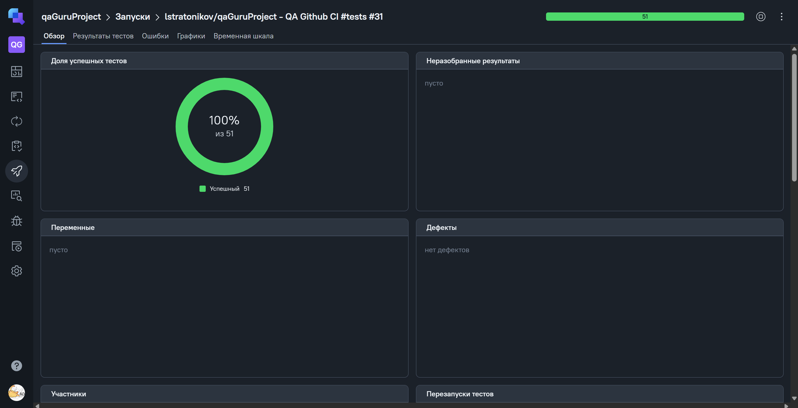

# Дипломный проект по автоматизации тестирования на JS + Playwright

## 📝 Описание проекта

Репозиторий содержит:

- **API-тесты** для `https://apichallenges.herokuapp.com`
- **UI-тесты** для `https://realworld.qa.guru`

Тесты написаны на языке **JavaScript** с использованием библиотеки **Playwright**

Настроен **GitHub Actions** и интеграции с ним:

- Запуск тестов в workflow - при push в любую ветку, а также при создании pull request в `main`
- Формирование Allure-отчёта после запуска тестов
- Публикация отчета на GitHub Pages
- Интеграция Github с Allure TestOps
- Уведомления в Telegram после прохождения тестов

---

## 🛠 Технологии

<div align="center">
  
  
  
  
  
  
</div>

##

- **[Playwright](https://playwright.dev/)** - тестирование UI + API
- **[Allure Report](https://github.com/allure-framework)** - Генерация отчетов
- **[Allure TestOps](https://allure.autotests.cloud/)** - Управление тестами
- **[GitHub Actions](https://github.com/features/actions)** - CI/CD
- **[Telegram Notifications](https://core.telegram.org/)** - Уведомления

## 🧩 Структура тестов

```plaintext
tests/
├── api/         # API-тесты
│   └── *.spec.js
└── ui/          # UI-тесты
    └── *.spec.js
```

## ⚡ Быстрый старт

- Клонирование репозитория: `git clone https://github.com/lstratonikov/qaGuruProject.git`
- Установка зависимостей: `npm install`
- Установка Playwright: `npx playwright install --with-deps`

## 🏁 Локальный запуск тестов

- Запуск всех тестов: `npm t`
- Запуск только API-тестов: `npm run test:api`
- Запуск только UI-тестов: `npm run test:ui`

## 📊 Allure-отчёт

[Пример отчета](https://lstratonikov.github.io/qaGuruProject)



---

## 📢 Telegram-уведомления



Уведомление включает в себя:

Статус прогона  
Ссылку на Allure-отчет  
Количество пройденных/упавших тестов

## 🔗 Интеграция с Allure TestOps

[Пример запуска](https://allure.autotests.cloud/project/5010)


